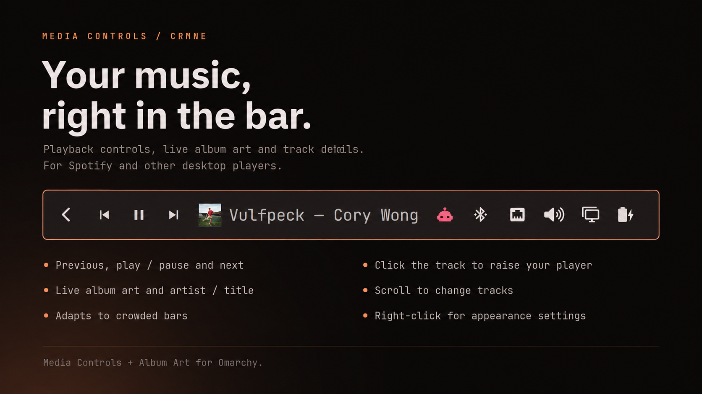

# Media Controls + Album Art for Omarchy

A native Quattro/Quickshell now-playing widget for the Omarchy bar, with media
controls, live album art, and artist/title details:



`previous` · `play/pause` · `next` · `album art` · `artist — title`

On crowded horizontal bars, the widget adapts independently on each monitor.
It shortens the label first, then drops previous/next, play/pause, and artwork
as necessary so it gives space back before the bar sections overlap. The full
track details remain available in the tooltip.

It works with Spotify and other Linux media players that expose the standard
MPRIS interface. The widget uses Quickshell's MPRIS service directly: it does
not poll `playerctl`, download cover art into `/tmp`, or depend on the old
Waybar scripts.

## Install

```bash
omarchy plugin add https://github.com/crmne/omarchy-mpris.git --enable --yes
omarchy bar move crmne.mpris --section right --before omarchy.tray
```

## Requirements

- Omarchy Quattro with its Quickshell-based shell.
- At least one media player exposing the standard MPRIS interface.

There are no additional packages or helper scripts. In particular, this plugin
uses Quickshell's MPRIS service directly and does not require `playerctl`.

## Remove

```bash
omarchy plugin remove crmne.mpris --yes
```

For local development, put or link this repository at
`~/.config/omarchy/plugins/crmne.mpris` and run:

```bash
omarchy-shell shell rescanPlugins
omarchy plugin enable crmne.mpris --section right --before omarchy.tray
```

Click album art or the label to raise the player, and middle-click there for
the previous track. Scrolling anywhere over the controls changes track.
Right-click any part of the widget to open its appearance panel.

The appearance panel and Omarchy bar settings expose adaptive layout,
transport controls, album artwork, artist visibility, album-art size, label
width, and a maximum artist/title character count.
